# Interfaces - *Comparativas*
julho de 2015  

***
***
|gWidgets                                     |rpanel                                     |shiny                                               |
|:-------------------------------------------:|:-----------------------------------------:|:--------------------------------------------------:|
|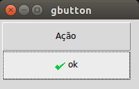               |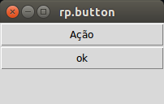         |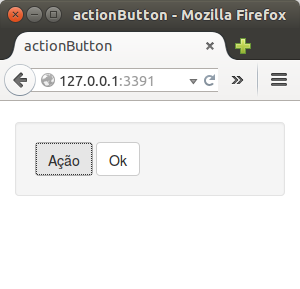            |
|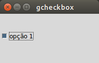           |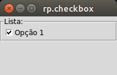     |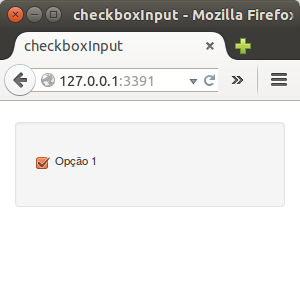          |
|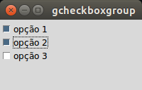 |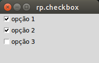   |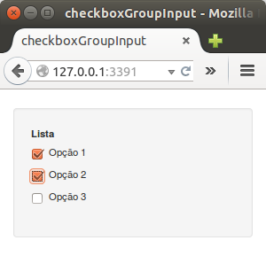|
|           |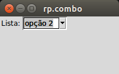           |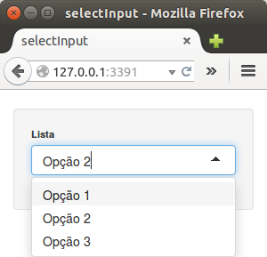              |
|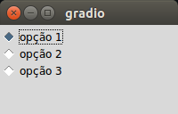                 |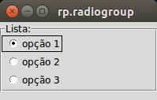 |            |
|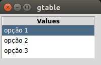                 |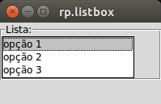       |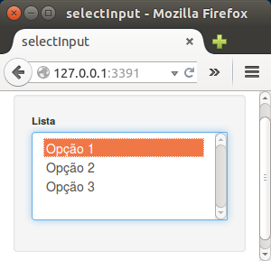            |
|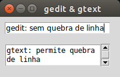             |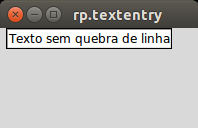   |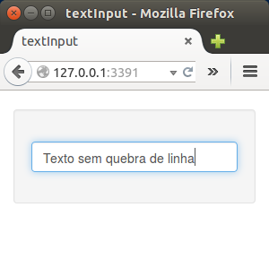                  |
|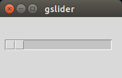               |         |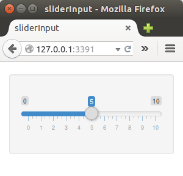              |
